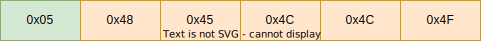
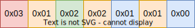
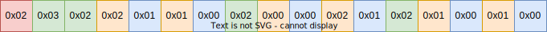

# /v3/tournaments/:id/brackets/:id/matches

This sub-endpoint is avaliable for all tournaments. It is only used to create a websocket connection and send/receive live updates the bracket state.

## GET `/v3/tournaments/:id/brackets/:id/matches`

Upgrades the http connection to a websocket connection. The connection can be used to send/receive updates of the bracket with the given `id` in realtime.

### Request Headers

Requires the following request headers to be set:
- `Upgrade: websocket`

### Response Body

The request contains contains no response body. Instead the server responds with a `101 Switching Protocols` status code and uses the connection for websocket messages.

### Errors

- `404 Not Found`: Returned if the tournament or bracket with the requested `id` does not exist.
- `426 Upgrade Required`: Returned if the request is missing the `Upgrade` header.

## Websocket protocol

The upgraded websocket connection uses a custom binary protocol. The protocol differenciates
between *Requests*, which are only sent by the client  and *Responses*, which are only sent
be the server. The protocol is full-duplex: both the client and server can start sending
data independently from each other.

The protocol only carries information about the matches itself. It does not provide any information about how matches are rendered or about how changes are propagated.

Requests can be differentiated between read and write queries. Read queries are avaliable to all clients, while write queries require previous authentication. The [Authorize](#authorize) request upgrades the current connection and allows write requests to be sent.

### Encoding

The protocol has support for encoding/decoding the following types:

| Type | Size (Bytes) | Note                                                                    |
| ---- | ------------ | ----------------------------------------------------------------------- |
| bool | 1            | A boolean type representing either `true` or `false`.                   |
| u8   | 1            | A byte encoded as is.                                                   |
| u16  | variable     | A varint encoded unsigned integer with a maximum width of 16 bits.      |
| u32  | variable     | A varint encoded unsigned integer with a maximum width if 32 bits.      |
| u64  | variable     | A varint encoded unsigned integer with a maximum width of 64 bits.      |
| i8   | 1            | A zigzag encoded byte.                                                  |
| i16  | variable     | A zigzag varint encoded signed integer with a maximum width of 16 bits. |
| i32  | variable     | A zigzag varint encoded signed integer with a maximum width of 32 bits. |
| i64  | variable     | A zigzag varint encoded signed integer with a maximum width of 64 bits. |
| [T]  | variable     | A sequence of `T` with a variable length.                               |
| str  | variable     | A UTF-8 encoded string.                                                 |

#### Integer encoding

All integer types with the exception of `u8` and `i8` are encoded using a variable integer 
encoding. Unsigned integers are encoded using the ULEB128 encoding. All integers represented
in little-endian.

The process of encoding an ULEB128 encoded integer is as follows:
1. Break the integer into groups of 7-bit
2. Encode the groups in little-endian
3. Set the MSB on every byte except the last

The process of decoding an ULEB128 encoded integer is as follows:
1. Read bytes from the input until a bytes doesn't have the MSB set
2. Remove every 8th bit (MSB) from the bytes, creating groups of 7-bit
3. Accumulate all bytes from little-endian

See [leb128.c](leb128.c) for an example C encode and decode implementation.

Signed integers are converted into their unsigned variant using a zigzag encoding. This 
encoding stores the sign bit in the LSB.

An signed integer `n` with `k` bits can be encoded using `(n << 1) ^ (n >> k - 1)`.

#### bool

A boolean type that is either `true` or `false`. Encoded as a u8 with a `0` representing 
`false` and a `1` representing `true`. All other byte values are invalid for this type.

#### Sequences and Strings

Sequences (variable-length arrays) and strings are encoded using the same format. A sequence first encodes the length of 
the sequence, or in other words, the number of elements in the sequence. The length is a `u64` using 
the varint encoding described above. After that every element is encoded.

Strings are encoded as a sequence of bytes (`u8`). Note that the length is **not the number of 
characters**, but the number of bytes. In the case of ASCII this is the same, but any UTF-8 byte
sequence is a valid string.

For example the string "Hello" has the length 5 and is encoded as follows:

#### General structure

The structure of the protocol is defined as tables/structs in the following sections, with the fields of the structs being encoded/decoded recursively.
The fields of the structs are ordered in the order they are shown. The encoded format is not self-describing, the field names are not contained in
the encoded message themselves and are only listed here for reference.

For example see the definition for the `Entrant Score` struct:

| Name   | Type |
| ------ | ---- |
| score  | u64  |
| winner | bool |

The process of encoding `Entrant Score` is:
1. Encode the `u64` value of the `score` field (resulting in 1-8 bytes)
2. Encode the `bool` value of the `winner` field (resulting in 1 byte)

The accumulated buffer is the encoded message:  

Some structs are defined with other structs in their fields. For example the `Match` struct is defined as:

| Name     | Type   |
| -------- | ------ |
| entrants | [Node] |

The process of encoding `Match` is:
1. Encode the `[Node]` value of the `entrants` field:
     1. Encode the length of the `Node` sequence as a `u64`
     2. Encode every `Node` using the logic above

The encoded version will look as follows:  

The process of decoding follows the same procedure.

#### Structures

The following section is an non-exhaustive list of all structs that are used in the protocol.
More strucuts may be added in the future.

##### Entrant Score

This struct contains the score for a single team in a match (heat). It also contains a byte
indicating whether the entrant is the winner of the match. The *Entrant Score* is commonly used
as a sequence of two, representing both entrants in a single match. Only a single entrant can have
the winner byte set, causing the other to be treated as the loser.

| Name   | Type |
| ------ | ---- |
| score  | u64  |
| winner | bool |

##### Match

A match represents a single match (heat) in the bracket. It always contains a sequence of
two *Node*s.

| Name     | Type   |
| -------- | ------ |
| entrants | [Node] |

##### Node

A *Node* describes a single team in a match. It contains the *Entrant Score* of the entrant (see above), and an index used to identify the entrant. The entrant can be resolved by
indexing the `entrants` field returned by the [`/v3/tournaments/:id/brackets` endpoint](../brackets.md#bracket).

| Name  | Type            |
| ----- | --------------- |
| index | u64             |
| score | *Entrant Score* |

### Requests

A request is sent from clients to the server. The first byte of the request contains the id of the
command that is being requested. After that follows the body of the command, if any.

| Command     | ID | Body | Description                                                                  |
| ----------- | -- | ---- | ---------------------------------------------------------------------------- |
| Reserved    | 0  | No   | Reserved for future use. This can safely be ignored.                         |
| Authorize   | 1  | Yes  | Authorize using an auth token. This is the same token used for the http api. |
| SyncState   | 2  | No   | Request the server to return the complete, current state of the bracket.     |
| UpdateMatch | 3  | Yes  | Update the match at a specified index. This requires authentication.          |
| ResetMatch  | 4  | Yes  | Reset the match at a specified index. This requires authentication.           |

Note that more commands may be added in the future.

#### Authorize

The `Authorize` command authenticates the active connection using the token provided. This is the same token
used by the HTTP API. It can be acquired using the `/v3/auth` endpoint. If the provided token is rejected
(i.e. it is invalid or expired) the server will respond with an `Error::Unauthorized` error. If the token is
valid there is no response.

| Name  | Type | Description                                                                   |
| ----- | ---- | ----------------------------------------------------------------------------- |
| token | str  | The token string as returned by the `/v3/auth` endpoint. **No Bearer prefix**  |

##### Example

Using the string `"HELLO WORLD"` as the `token` field:  

#### SyncState

The `SyncState` command requests the server to return a complete, up-to-date state of the bracket. The 
server responds with a `SyncState` response. This command has no body.

##### Example

Request a sync state:  

#### UpdateMatch

The `UpdateMatch` command updates the match at the specified index. The body contains the index and the 
updated
data. This command requires that the active connection is authenticated. If it is not an 
`Error::Unauthorized` response
is returned. Otherwise if this command succeeds the server will return a `UpdateMatch` response with the 
same data.

| Name  | Type           | Description                                                                           |
| ----- | -------------- | ------------------------------------------------------------------------------------- |
| index | u64            | The index of the match.                                                               |
| nodes | [EntrantScore] | An array of the updated data. This currently always has the length 2 (red/blue team). |

`EntrantScore` definition:

| Name   | Type | Description                   |
| ------ | ---- | ----------------------------- |
| score  | u64  | The score of the node.        |
| winner | bool | Whether the node is a winner. |

##### Example

Update the match at index `1` to the score `2:1` and set the first entrant as the winner.  

#### ResetMatch

The `ResetMatch` command reset the match at the specified index. The body contains the index of
match. This command requires that the active connection is authenticated. If it is not and
`Error::Unauthorized` error is returned. Otherwise if this command succeeds the server will return
a `ResetMatch` response with the same data.

| Name  | Type | Description                      |
| ----- | ---- | -------------------------------- |
| index | u64  | The index of the match to reset. |

##### Example

Reset the match at index `1`.  

### Responses

Responses follow the format that requests do. The first byte contains the id of the event that is
being returned. After that follows the event body, if any.

| Event       | ID | Body | Description                                                           |
| ----------- | -- | ---- | --------------------------------------------------------------------- |
| Reserved    | 0  | No   | Reserved for future use. This can safely be ignored.                  |
| Error       | 1  | Yes  | An error message.                                                     |
| SyncState   | 2  | Yes  | Contains the complete state of the bracket.                           |
| UpdateMatch | 3  | Yes  | Update the match at a specified index.                                |
| ResetMatch  | 4  | Yes  | Reset the match at a specified index.                                 |

Note that there may be more events added in the future. They can be safely ignored.

#### Error

This response indicates that an error has occured. This is commonly sent directly in response to a request.
The body contains the id of the error that happened.

| Error        | ID | Description |
| ------------ | -- | ----------- |
| Internal     | 0  | An unrecoverable internal server error. The connection will be dropped after this error is sent. |
| Proto        | 1  | An unspecified error in the protocol. This usually happens when the client sends an invalid request. |
| Unauthorized | 2  | A sent request required authentication, but it was set. This is also returned when an invalid token is provided. |
| Lagged       | 3  | The event queue for this connection lagged behind and some events were lost. The client may want to request `SyncState` again. This usually happens when the connection is very slow. |
| ProtoInvalidVariant  | 128 | A specialized protocol error: an invalid variant was decoded (e.g. a bool that was not true/false). |
| ProtoInvalidSeq   | 129 | A specialized protocol error: a sequence was shorter than the provided length. |
| ProtoInvalidStr   | 130 | A specialized protocol error: a string contained an invalid UTF-8 byte sequence. |
| ProtoIntOverflow  | 131 | A specialized protocol error: A varint-encoded integer was too long. Note that this may also be returned when the varint is malformed. |

#### SyncState

The `SyncState` is returned in response to a `SyncState` request. It contains the complete state of
the bracket.

| Name    | Type    | Description                           |
| ------- | ------- | ------------------------------------- |
| matches | [Match] | A list of all matches in the bracket. |

A `Match` contains:
| Name     | Type          | Description |
| -------- | ------------- | ----------- |
| entrants | [EntrantSpot] | A list of entrants in a match. This currently always has the length 2
(red/blue team). |

An `EntrantSpot` describes a position in a match. The position be `Empty` (displayed as *BYE* on the frontend), `TBD` (displayed as *TBD* on the frontend) or it contain a reference to an entrant. An `EntrantSpot` is encoded as a single byte representing the variant of the position. If the variant contains an entrant it is encoded afterwards.
| Name    | Byte |
| ------- | ---- |
| Empty   | 0    |
| TBD     | 1    |
| Entrant | 2    |

If the `EntrantSpot` is an `Entrant` variant, it contains a `Node`. A `Node` contains a reference (index) to an entrant and the state (score/winner):
| Name  | Type        | Description               |
| ----- | ----------- | ------------------------- |
| index | Type        | The index of the entrant. |
| data  | EntrantSpot | The state of the node.    |

The data field of a `Node` contains a `EntrantScore`. A `EntrantScore` contains a score and winner flag.
| Name   | Type | Description                   |
| ------ | ---- | ----------------------------- |
| score  | u64  | The score of the node.        |
| winner | bool | Whether the node is a winner. |

##### Example

Get the state of a single elimination bracket with three rounds. The scores in the first round are defined as `2:1` and `0:2`. The scores in the second round are defined as `1:1` and no winner has been set yet.  

#### UpdateMatch

The `UpdateMatch` event notifies the client about an updated match in the bracket. The body contains the index
of the updated match and the updated values.

Note: The body has the same format as the `UpdateMatch` request.

| Name  | Type           | Description                                                                           |
| ----- | -------------- | ------------------------------------------------------------------------------------- |
| index | u64            | The index of the match.                                                               |
| nodes | [EntrantScore] | An array of the updated data. This currently always has the length 2 (red/blue team). |

`EntrantScore` definition:

| Name   | Type | Description                   |
| ------ | ---- | ----------------------------- |
| score  | u64  | The score of the node.        |
| winner | bool | Whether the node is a winner. |

##### Example

Update the match at index `1` to the score `2:1` and set the first entrant as the winner.  

#### ResetMatch

The `ResetMatch` event notifies the client about a resetted match in the bracket. The body contains the index
of the resetted match.

Note: The body has the same format as the `ResetMatch` request.

| Name  | Type | Description                      |
| ----- | ---- | -------------------------------- |
| index | u64  | The index of the match to reset. |

##### Example

Reset the match at index `1`.  

